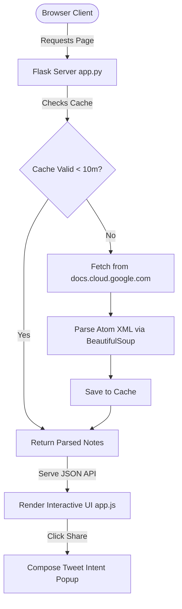

# 📊 BigQuery Release Notes Explorer

A premium, modern web dashboard built with **Python Flask** and **Vanilla HTML5, JavaScript (ES6+), and CSS3** to aggregate, parse, search, and share Google Cloud BigQuery Release Notes.

---

## 🚀 Key Features

*   **⚡ Smart Parser & Grouper**: Automatically parses raw HTML elements from the feed and breaks daily release notes into structured sub-items categorized by type (`Feature`, `Change`, `Deprecation`, `Fix`).
*   **🐦 One-Click Twitter (X) Sharing**: Seamlessly compose and post specific release items. It extracts text snippets, formats headers, tags (`#GCP #BigQuery`), and trims content to stay within standard character limits.
*   **🔍 Full-Text Search with Highlighting**: Real-time fuzzy filtering of release notes with highlighted keywords matching your search query.
*   **🏷️ Categorized Filters**: Narrow down updates globally by category (e.g., viewing only features, or only fixes).
*   **🌓 Sleek Dual-Theme Interface**: A glassmorphic dark theme (default) and a clean light theme, complete with state persistence, animations, and custom scrollbars.
*   **💾 Flask Server Caching**: Leverages in-memory server caching with a 10-minute TTL to reduce feed loading times and prevent rate limits.

---

## 🛠️ Technology Stack

*   **Backend**: Python 3.11+, Flask 3.0.3, Requests (fetching), BeautifulSoup4 & lxml (XML parsing)
*   **Frontend**: Vanilla HTML5, Vanilla CSS3 (Custom properties, Glassmorphism, animations), Vanilla JavaScript (DOM manipulation, event delegation, client-side filtering)
*   **Icons & Typography**: FontAwesome 6, Google Fonts (Inter, JetBrains Mono)

---

## 📁 Repository Structure

```
sample-app/
│
├── app.py                  # Flask server, Atom feed requester, XML parser & caching
├── requirements.txt        # Backend dependencies
├── run.bat                 # Windows one-click launcher
├── README.md               # Project documentation
│
├── templates/
│   └── index.html          # HTML5 layout template
│
└── static/
    ├── css/
    │   └── style.css       # Core stylesheets & UI design systems
    └── js/
        └── app.js          # Client-side routing, query filter logic & X sharing handlers
```

---

## ⚙️ How it Works (Architecture Flow)



---

## ⚡ Quick Start

### 1. Prerequisites
Make sure you have Python (version 3.11 or later) installed.

### 2. Install Dependencies
Run pip in your terminal to fetch the required parsing and web packages:
```bash
pip install -r requirements.txt
```

### 3. Running the Server

#### On Windows
Simply double-click the **`run.bat`** file, which automatically configures the python launcher, fires up the server, and launches your browser. Alternatively, run:
```cmd
py -3.11 app.py
```

#### On Linux / macOS
Open a terminal inside the project directory and run:
```bash
python3 app.py
```

Navigate to **`http://127.0.0.1:5000`** in your browser to view the application.

---

## 🌐 API Endpoint Reference

### `GET /api/releases`
Fetches and returns the parsed and structured BigQuery release notes.

**Response Schema:**
```json
{
  "success": true,
  "count": 30,
  "releases": [
    {
      "title": "June 25, 2026",
      "id": "https://docs.cloud.google.com/feeds/bigquery-release-notes.xml#June_25_2026",
      "date": "2026-06-25T00:00:00Z",
      "content": "<h3>Feature</h3><p>VECTOR_SEARCH description...</p>"
    }
  ]
}
```

---

## 📄 License
This project is open-source and available under the MIT License.
